# 連載：WindowsユーザーのためのDockerコンテナ入門（Azure活用編）

# Dockerホストの作製とDockerコンテナのロードまで

>アバナード　旭 哲男  
>2016/mm/dd

システム開発のライフサイクルのなかで見過ごされやすいタスクに、「環境の整備」があると著者は考えている。
熟練の開発者であれば、自分がこれから設計・開発・テストするための環境整備の方法を頭に思い描き、かつ整備することができると思うが、
チームに参画するメンバーすべてが一様に整備できるかというと、実際にはそんなことはなく、
できるメンバーがつきっきりで、環境を構築することが多いのではないだろうか。

またはテストも完了し、運用環境へのデプロイ作業を運用メンバーに依頼したが、システムが正しく作動せず、
結局開発メンバーがデプロイ作業を実施するなどして、お互いに不信感を持ってしまうということが発生していないだろうか。
これらの問題が発生する原因の一つには、環境整備は属人的な側面が多大にあり、たとえマニュアルを整備したとしても、
マニュアルの整備がおいつかず結果として、上記のような問題が発生しているものと思われる。*マニュアル*の代わりに*スクリプト*と置き換えても、同じことが言えるだろう。

では、環境をより簡単に整備するにはどうしたらよいだろうか。環境を丸ごととっておき、それを必要に応じて使用できれば良いのではないだろうか。
環境を丸ごとコピーするという考え方自体は昔からある考え形であり、仮想マシンを活用すれば仮想マシンごと丸ごとコピーして、データセンターのホストや、
クラウドサービスにデプロイできるのはご存じのとおりである。

　Dockerもまた、環境を丸ごとDockerコンテナとして管理することができ、コンテナをコピーしてDockerホストにデプロイするということができる。
では、Dockerコンテナと仮想マシンは何が違うのか。一つには、Dockerコンテナは「必要最小限で構成された軽量のイメージであり、より少ないリソースで稼働できる」があげられるが、
これ以外にもDockerには、“コンテナをスタックする”、“コンテナをリポジトリで管理する”といった、コンテナのカスタマイズ・デプロイに特化した機能があり、
仮想マシンにはないメリットがある。

>本稿では、Dockerのシステム構成については触れない。Dockerホスト、Dockerコンテナの
>詳細については　[What is Docker](https://www.docker.com/what-docker)　を参照のこと。

従来はDockerを使うためにLinuxの知識が不可欠であったが、Azureクラウド環境を活用して、
より容易にDockerを使えるようになった。本稿では、WindowsユーザーがDockerホストを作成し、Dockerコンテナをロードするまでの手順を説明する。

--------

## 前準備

本稿では、DockerホストとしてAzure上のLinuxのVMを使用する。Linuxではあるが、ほとんどの設定をWindowsのコマンドから実行できるため、Linuxの知見がなくても問題ない。
>Windows Server 2016ではDockerホストの機能が提供される予定だが、
>執筆時点ではDockerホストとして、Windows Server 2016を選択することができない。

Dockerホストを構築する前に、以下の準備が必要である。

- Microsoft Azureアカウント  
アカウントのアクティベーションについては、ｘｘ参照。
- クライアントPC  
本稿ではWindows 10で操作しているが、Windows7/8/8.1でも動作可能。
- インターネット接続環境  
各種ツールのインストールおよび、Dockerコンテナを操作するためにインターネットへの接続環境が必要である。プロキシ経由での接続については本稿では扱わない。

作業を進める中で、シェルを頻繁に変更する。記事中以下の表記が出てきたときは、それぞれシェルを使い分けていることに注意。

| 記載例 | シェル | 起動方法 |
| --- | --- | --- |
| PS> | PowerShell | スタート→”PowerShell”で検索→アイコンを右クリックし「管理者として実行」 |
| CMD> | コマンドプロンプト | スタート→”CMD”で検索→クリック |
| SSH> | Putty SSHセッション | コマンドプロンプトから”putty”を入力して起動 |

Dockerホスト/コンテナを操作するためには、以下のツールのセットアップが必要である。

1. Chocolatey（パッケージ管理ツール）
1. node.js / npm（JavaScript実行環境）
1. Azure-cli（Azure管理ツール）
1. Docker（Dockerクライアント）
1. Putty（SSHクライアント）

以下順を追って説明する。

### Chocolateyのインストール

本稿では、各種ツールのインストールを [Chocolatey](https://chocolatey.org/)で行う。
Chocolateyのインストールする前に、PowerShellの実行ポリシーが”Remote Signed”以上であることを確認する。
もし、”Restricted”や”Undefined”だった場合には“Remote Signed”変更すること。
実行ポリシーが”Remote Signed”以上であることを確認したら、Cocolateyをインストールする。

> 以下 **PS>**や**CMD>** はプロンプトを意味している。実際の入力に当たっては PS> より後の部分を入力すること。

```Powershell
#実行ポリシーの確認
PS> Get-ExecutionPolicy
#実行ポリシーの設定
PS> Set-ExecutionPolicy RemoteSigned
#Chocolateyのインストール
PS> iex ((New-Object System.Net.WebClient).DownloadString('https://chocolatey.org/install.ps1')) 
#Chocolateyの動作確認
PS> choco
```

### node.js / nmpのインストール

Azureの各種サービスを操作するために、Azure-cliを動作させるための実行環境としてnode.jsおよびnpmをインストールする。
すでに、Microsoft Web PIなどでインストール済みであれば次のステップへ。

```Powershell
#node.jsのインストール
PS> choco install node.js
#npmのインストール
PS> choco install npm
#npmの動作確認
CMD> npm
```

>npmは、PowerShellではなく、コマンドプロンプトから起動できることに注意。
>PowerShell上で作業を継続する場合には、PATH環境変数の内容を反映させるため、一度PowerShellを起動しなおすこと。

### Azure-cliのインストール

Azureの管理ツールをインストールする。Azure Dockerホストを作成するためには、Azure-cliが必須である。

```Powershell
#Azure-cliのインストール
CMD> npm install -g azure-cli
#azure-cliの動作確認
CMD> azure help
```

### Dockerのインストール

DockerコンテナをクライアントPCから操作する場合にインストールが必要である。
Dockerホストにアクセスして、直接Dockerコンテナを操作する場合は、インストール不要だがインストールしておくことを推奨する。

```Powershell
#Dockerクライアントのインストール
PS> choco install docker
#Dockerクライアントの動作確認
PS> docker help
```

### puttyのインストール

Dockerホストに接続するために必要。Dockerホスト上でのストレージデバイスのマウントや、Dockerコンテナ用のディレクトリの作成など、
Dockerクライアントからは操作できないことは、Dockerホストに接続して実施する必要がある。

```Powershell
#puttyのインストール
PS> choco install putty
#puttyの動作確認
PS> putty
```

--------

## Dockerホストの作製

ツールのインストールができたら、Docker環境を構築する。
Dockerを使用するためには、Dockerホストを用意しなければならない。現時点のAzureでは、DockerホストとしてLinux仮想マシンを使用することができる。
仮想マシンの作成には、Azure-cliを使用する。以下、順を追って説明する。

### Azureログイン

まず初めに、Azure-cliでログインをする。以下の```CMD> azure login```を実行し、出力されたURLと認証コードを確認する。
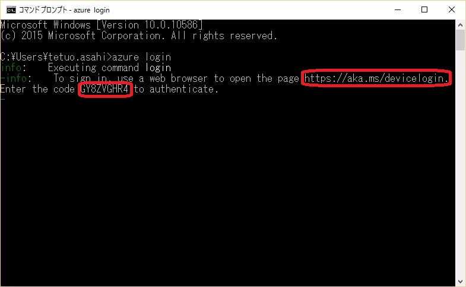

出力されたURLを、ブラウザで開くと、以下のような画面になるので、先ほどの認証コードを入力する。


認証コードが正しい場合、端末からのアクセスを許容するかどうか質問されるので、「続行」ボタンを押す。
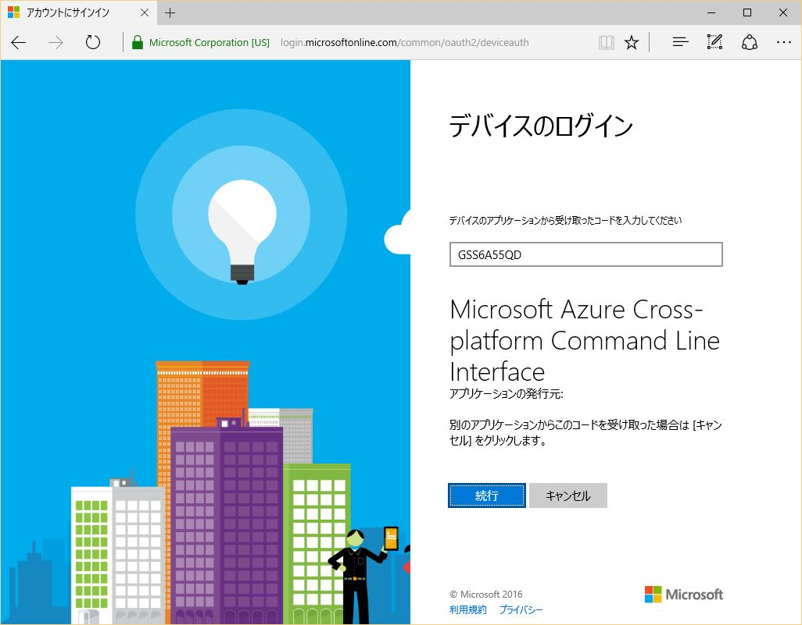

さらに、Azureの認証アカウントを選択する。
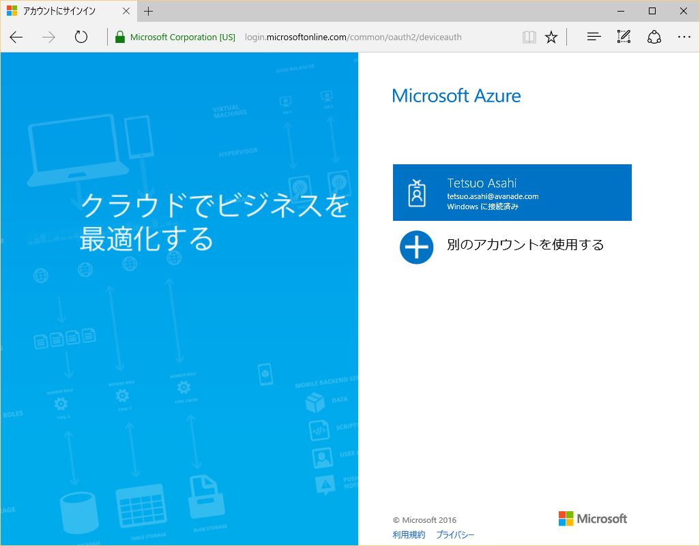

認証が成功すると以下のような画面になる、ブラウザを閉じ、Azure loginの結果を確認する。
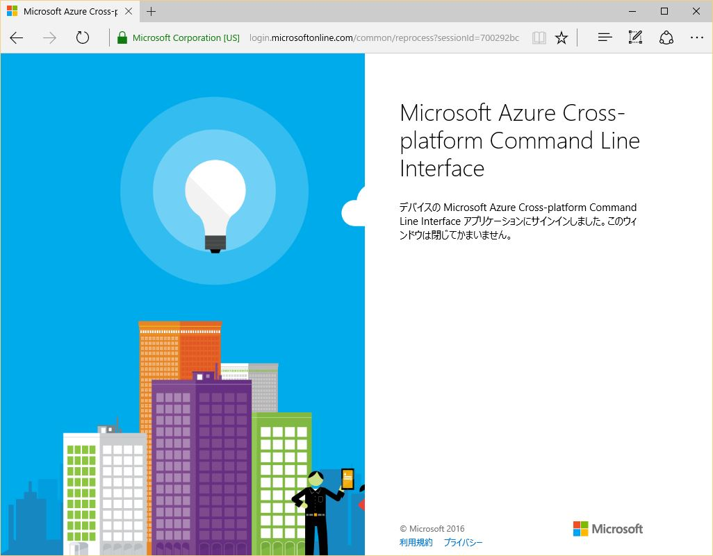


### Azure VMイメージの確認

Dockerホストを作製するための仮想マシンのOSイメージを選択する。```azure vm list```コマンドを実行し、
**Ubuntu 14_04**のイメージの名称をメモする。また、```azure vm show```コマンドを実行することで
仮想マシンの詳細を知ることができる。

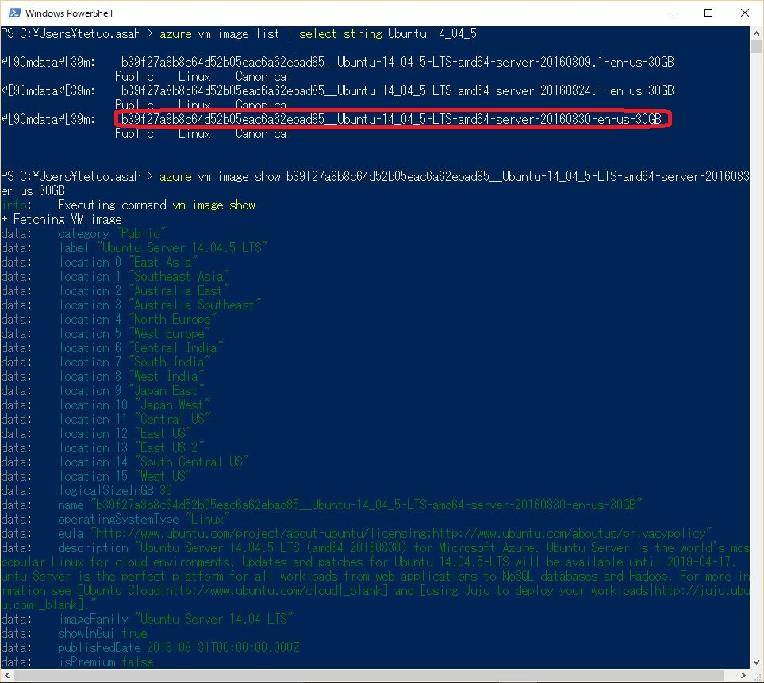

> ここでは、Ubuntu 14を選択したが、CentOSやDebianも選択可能である。
> なお、Microsoft のAzure関連のブログ記事では Ubuntuで説明されていることが多いため、特段の要件がなければUbuntuを選択するのが良いだろう。

### Azure Docker ホストの作製

いよいよDockerホストを作成する。本稿では、Dockerコンテナをロードできるまでを説明するため、デフォルト構成でホストを作製する。

```PowerShell
#Azure Dockerホスト作成コマンド
azure vm docker create -e 22 -l "Japan East" [ホスト名] "仮想マシンイメージ" [仮想マシンの管理ユーザ] [管理ユーザのパスワード]
```

ここでは以下のように設定した。４～５分程度でVMが生成される。

|パラメータ|値|
|---|---|
|ホスト名|BldinsDcrHst|
|仮想イメージ|b39f27a8b8c64d52b05eac6a62ebad85__Ubuntu-14_04_5-LTS-amd64-server-20160830-en-us-30GB|
|管理ユーザ名|builder|
|パスワード|Bu!lder123|

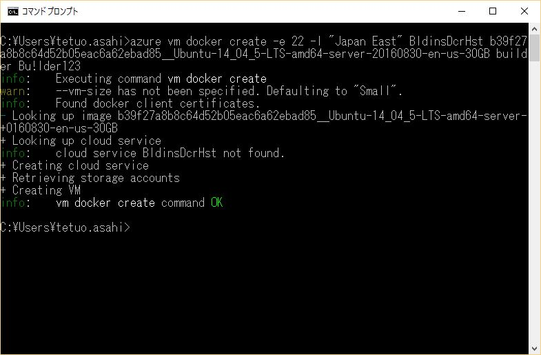

実際に、Dockerを活用するためには、どのようなDockerコンテナをロードするのか、各コンテナはどのくらいのCPUリソース、メモリを消費するのかを
見極めたうえで、Dockerホストのスペックを決める必要がある。

> 例えば、一般的なWebアプリケーション環境を構築するのであれば、Webサーバ、アプリケーションサーバ、データベースの
> 3つのコンテナをロードするのが一般的だろう。複数のコンテナを組み合わせて、環境を構築する手順については、第3回で解説する予定である。

### Dockerホストの確認

ホストが生成されたかどうかを確認する。```azure vm list```コマンドで、ホスト名が表示されているか確認し、
```azure vm show```コマンドで仮想マシンの状態を確認する。

```PowerShell
#Azure VMの一覧取得
CMD> azure vm list
#VMの詳細
CMD> azure vm show BldinsDcrHst
```

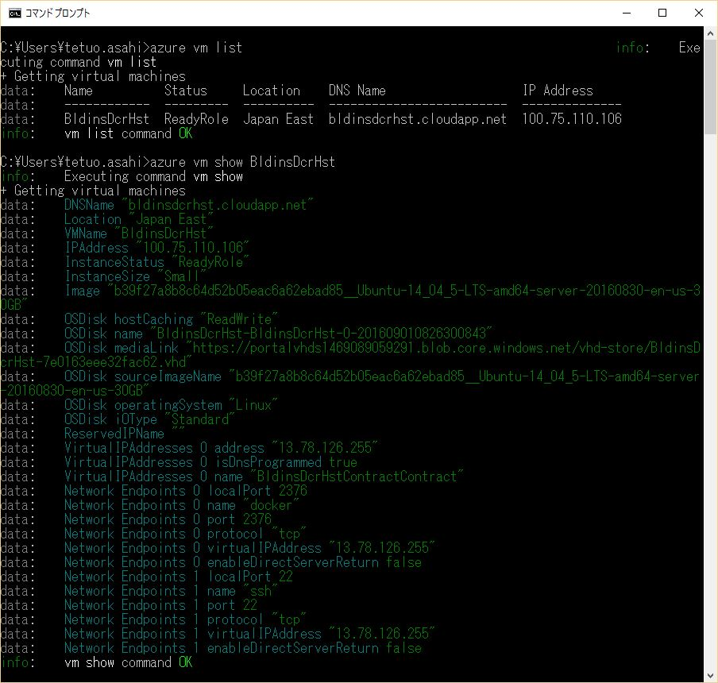

### Dockerホストへの接続と、SSH暗号化キーの作製

Azure Dockerホストにログインできるか確認する。puttyを起動（```putty```コマンドを実行）し、接続先情報を設定する。
Hostnameに先ほど確認した、ホストのFQDNを入力、Saved Sessionsに任意の接続名を入力して、「Save」ボタンを押下する。

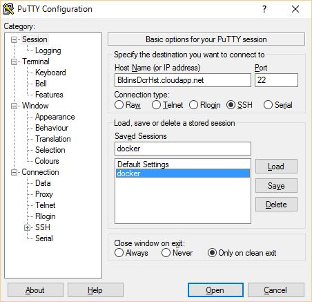

「OK」ボタンを押すと、仮想マシンに接続する。Dockerホストを作成時に指定した、ユーザ名とパスワードを入力し接続できるか確認する。

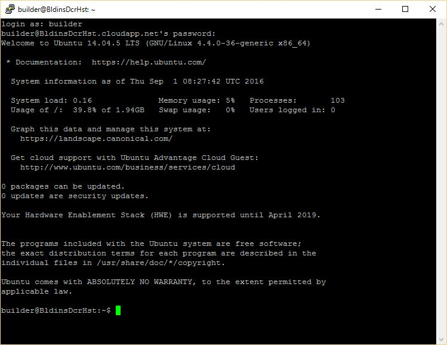

この仮想マシンは初めから、Dockerホストとして構成されており、追加パッケージをインストールすることなく、Dockerコマンドを実行可能である。
試しに、Dockerの環境情報を取得し、ログアウトする。

```SH
# Docker環境情報の確認
SSH> docker info
# 仮想マシンからログアウト
SSH> exit
```

このままでも運用は可能だが、認証がパスワードだけというのは心細い、セキュリティを強化するためにSSHキーペアを作成する。

```CMD
CMD> puttygen
```

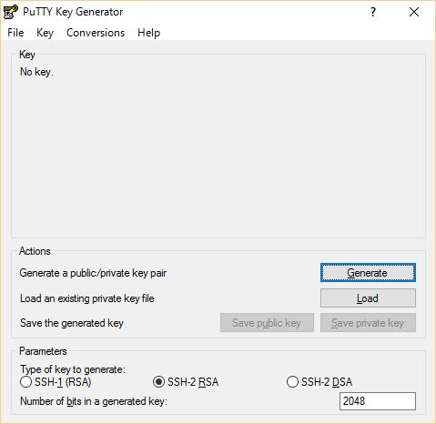

「Generate」ボタンを押下し、Keyの領域で以下のような画面になるまでマウスを動かす。
生成されたキーペアはそれぞれ、後の認証で使用するので、「key passphrase（開錠のためのパスワード）」を入力し、
「Save public key」「Save private key」を押下して、ファイルとして保存すること。

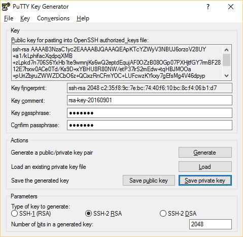

つぎに、Azure Portalにアクセスし、作成した仮想マシンを選択し、パスワードのリセットを選択、ユーザ名に管理ユーザ名、認証の種類として
**SSH公開鍵**を選択し、puttygenで生成されたpublicキーを入力する。

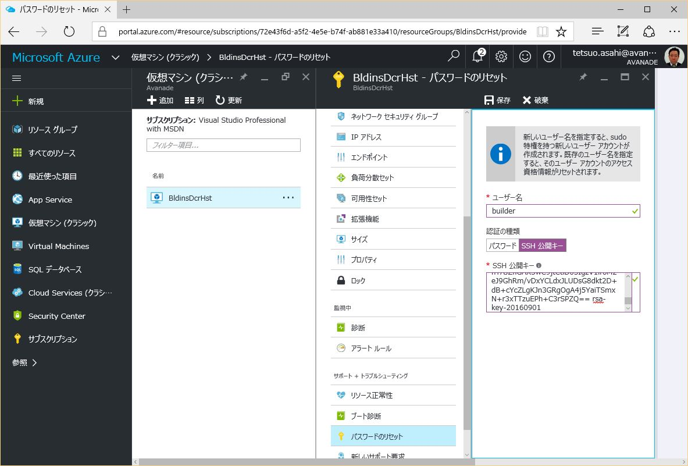

仮想マシンのパスワードがリセットされたら、puttyの接続設定を修正する。
puttyを起動し、接続設定画面が表示されたら、「Connection-SSH-Auth」を選択し、
Privte key file for authenticagtionに、puttygenで生成した秘密鍵のファイルパスを指定する。

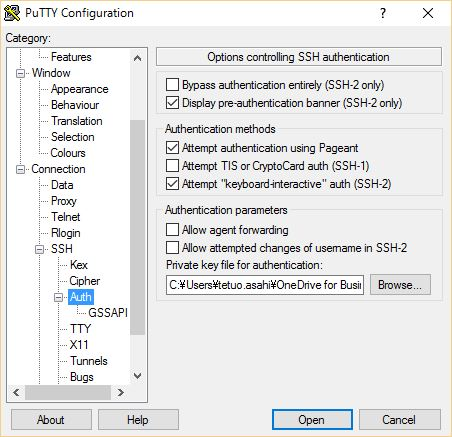

SSH秘密鍵を指定すると、ログイン時に秘密鍵に対するパスワードを聞いてくるので、puttygenでキーペアを
生成したときに入力したパスワードを入力するとログインできる。

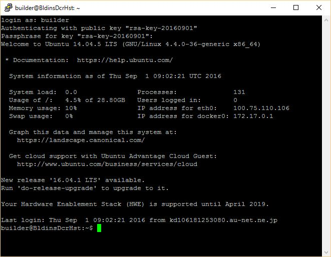

> ここで生成した、鍵ファイルとパスワードは大切に保管しなければならない。
> これらがないと、ログインできなくなってしまうため、鍵ファイルを削除またはパスワードを忘れた場合には、
> もう一度、SSHキーペアの作製と、仮想マシンのパスワードリセットが必要になる。

> 逆に言えば、秘密鍵ファイルとパスワードがあれば、仮想マシンにアクセスできるので、秘密鍵ファイルを
> 外部から参照できるようなところに置いてはいけない。


--------

## Dockerコンテナのロード

--------

## Dockerコンテナの停止
